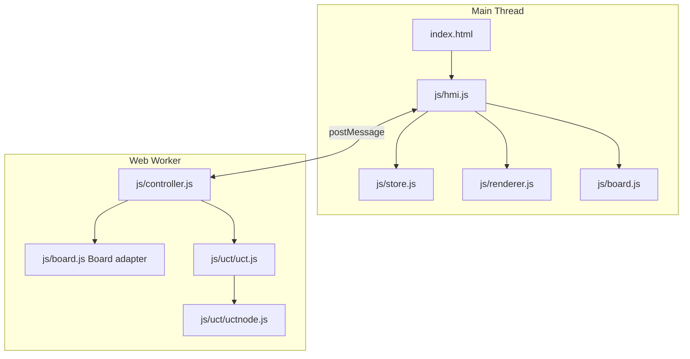

# Software Architecture - Max Adder

> Copyright (c) 2016, 2026 Oliver Merkel. MIT License.

## 1. Overview

This project is a browser-only single-page application implementing Max Adder
with optional human and AI players. It uses modern ES modules, a Web Worker for
game and AI control, and no runtime framework.

Core characteristics:

- ES module architecture with a single entry point.
- Pure tile, marker, score, and turn transitions for deterministic testing.
- Worker-owned authoritative game state.
- MCTS/UCT AI engine for selecting legal Max Adder actions.
- SVG renderer in the main thread.
- Vitest unit tests and Playwright E2E tests.

For detailed UCT/MCTS internals and budget tuning, see [engine_mcts_ucb.md](engine_mcts_ucb.md).

## 2. High-Level Architecture



## 3. Runtime Data Flow

1. UI sends `start`, `restart`, `move`, `action_by_ai`, or `sync` requests to
  the worker.
2. Worker updates tile, marker, score, and turn state, then posts `redraw`,
  `human_to_move`, or `ai_to_move` messages.
3. HMI maps worker messages to store actions.
4. Store updates state and triggers renderer updates.

Main move loop:

- During setup, the game creates the 8 x 8 tile layout, assigns horizontal and
  vertical roles, selects the starting player, and handles the opening tile.
- A human selects a legal destination on the active marker's row or column.
- Worker validates and applies the tile-collecting action.
- If the game is terminal, worker stops handoff.
- Otherwise worker posts `human_to_move` or `ai_to_move`.

UI status loop:

- Store updates trigger board re-render in
  `renderer.render(boardState, selectableActions)`.
- The hamburger icon in the title bar opens the sidebar navigation. The sidebar
  contains New Game, Rules, Options, and About entries, and the overlay or
  close button dismisses it.
- Selecting a subpage dispatches `NAVIGATE`; the view reducer hides every other
  section so only the selected view is visible. Back controls dispatch
  navigation to the game view.
- Header title changes by active view or to `AI thinking...` during AI turns.
- Header badge reflects horizontal/vertical strengths and device profile (for
  example `Horizontal Easy | Vertical Hard | Desktop`).

## 4. Module Responsibilities

### `js/common.js`

Shared constants:

- `COLUMNS = 8`, `ROWS = 8`
- empty-tile and player-role values
- `PLAYERS = { HUMAN, AI }`

The game model identifies the two roles as horizontal and vertical. Their
assignment to players is part of the board state and is selected at setup.

### `js/board.js`

Pure Max Adder state logic plus the mutable adapter class used by UCT.

State shape:

```js
{
  active: 0 | 1,
  tiles: number[8][8],
  markers: [{ row, col }, { row, col }],
  roles: ["horizontal" | "vertical", "horizontal" | "vertical"],
  scores: [number, number],
  opening: { player, field, value, recipient } | null,
  latestMove: { from, to, value, player } | null,
  moveHistory: array,
  result: { winner, reason } | null
}
```

Key exports:

- `createBoard()`
- `getActions(board)` -> legal Max Adder actions
- `doAction(board, action)` -> apply a tile-collecting move and evaluate the result
- `getResult(board)` -> reward vector for UCT
- `Board` mutable adapter (`getActions`, `doAction`, `copy`, `getResult`, `active`)

The rules engine generates destinations on the active marker's controlled axis,
removes the selected number tile, updates the active player's score, advances
the turn, and detects the two terminal conditions: no tiles remain or no tile
is available in the active marker's row or column. Opening placement and the
opponent's allocation decision are represented explicitly in the state flow.

### `js/renderer.js`

SVG board renderer for an 8 x 8 Max Adder board.

- `createRenderer(container, onCellClick)`
- `render(boardState, selectableActions, selectedCell)`
- Highlights the active marker, legal destinations, the latest move, and
  remaining number tiles.
- Renders file/rank coordinate annotations and the horizontal/vertical marker
  roles.
- Renders score, tile-value, and terminal-result information.

### `js/store.js`

Reactive state container and reducer.

Main UI state fields:

- `view`
- `board`
- `selectableActions`
- `phase`
  - `settings: { playerHorizontal, playerVertical, difficultyHorizontal,
    difficultyVertical, deviceProfile, resolvedDeviceProfile }`

Actions:

- `NAVIGATE`
- `ENGINE_BOARD_UPDATE`
- `HUMAN_TURN_READY`
- `AI_THINKING`
- `SETTINGS_CHANGE`
- `NEW_GAME`

### `js/controller.js`

Worker-side orchestration.

- Owns board state (`Board` instance).
- Applies settings from UI, including independent horizontal/vertical
  difficulty and the resolved device profile.
- Uses profile-specific MCTS budget tables (Desktop/Mobile).
- Chooses the budget by the active player's assigned role each AI turn.
- Delegates AI move selection to `Uct.getActionInfo(...)`.

Algorithm details, UCB equation, and parameter interaction are documented in
[engine_mcts_ucb.md](engine_mcts_ucb.md).

### `js/hmi.js`

Main-thread composition module.

- Creates store, renderer, and worker.
- Wires the hamburger icon, sidebar menu, overlay, subpage navigation, and Back
  controls.
- Reads player, difficulty, and device-profile options and sends them to the
  worker.
- Dispatches worker events into store.
- Maintains the horizontal/vertical difficulty badge from store settings.
- Renders score and tile-collection history from board snapshots.
- Keeps the score display visible beside the board in landscape and above or
  below the board as required by the viewport.

### `index.html`

Main document shell and static view content.

- Defines the title bar, hamburger icon, game, Rules, Options, and About
  sections, sidebar menu, and sidebar overlay.
- Provides the board and scores in the game view.
- Documents Max Adder rules in the Rules view so the in-app wording matches
  the engine behavior.
- Exposes player, AI difficulty, and device-profile settings in Options.
- Provides application and licensing information in About.
- Provides Back, OK, Cancel, close, and navigation controls used by HMI to
  switch among subpages and return to the game.

### Worker events and store actions

Worker messages consumed in HMI:

- `redraw` -> `ENGINE_BOARD_UPDATE`
- `human_to_move` -> `HUMAN_TURN_READY`
- `ai_to_move` -> `AI_THINKING` then request `action_by_ai`

Reducer actions in `js/store.js`:

- `NAVIGATE`
- `ENGINE_BOARD_UPDATE`
- `HUMAN_TURN_READY`
- `AI_THINKING`
- `SETTINGS_CHANGE`
- `NEW_GAME`

## 5. Threading Model

- Main thread: rendering, UI events, and navigation state.
- Worker thread: rules, turn progression, and AI computation.

Worker is the single writer for game state. The main thread consumes snapshots
broadcast by the worker.

## 6. Testing

- Unit tests: `tests/unit/*.test.js`
  - Tile setup and marker roles
  - Legal horizontal and vertical movement
  - Tile removal, scoring, opening allocation, and terminal results
  - Renderer data and coordinate annotations
  - UCT behavior and adapter integration
- E2E tests: `tests/e2e/game.spec.js`
  - Navigation and options
  - Difficulty badge updates
  - Interactive marker movement and scoring
  - Landscape and portrait score placement
  - Accessibility smoke checks

## 7. Folder Structure

```text
src/
├── index.html
├── css/index.css
├── js/
│   ├── common.js
│   ├── board.js
│   ├── controller.js
│   ├── hmi.js
│   ├── renderer.js
│   ├── store.js
│   └── uct/
│       ├── uct.js
│       └── uctnode.js
└── tests/
    ├── e2e/game.spec.js
    └── unit/*.test.js

Repository documentation:

doc/
├── engine_mcts_ucb.md
├── requirements.md
├── rules.md
├── regeln.md
└── software_architecture.md
```
